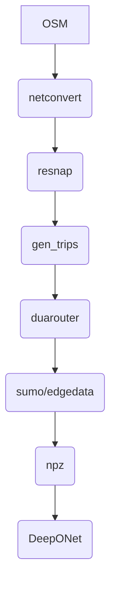

# Shanghai 5km: OSM → SUMO → DeepONet

## 目录结构
```bash
net/ # 路网与投影结果
data/ # 输入/输出数据（npz等不进repo或用LFS）
scenarios/ # S001..S006（routes、run.sumocfg、additional等）
scripts/ # 工具脚本
configs/ # 参数yaml等
models/ # 训练产物（本地保留）
```


## 快速开始
```bash
# 1) build_net_from_osm 生成路网（示例）
python scripts\build_net_from_osm 
netconvert --osm-files net\shanghai_5km.osm.xml --proj "utm,51N" --tls.guess true --junctions.join true --keep-edges.by-vclass passenger --remove-edges.islands -o net\shanghai_5km.net.xml

# 2) 吸附 C101
python scripts\resnap_customers_v2.py --net net\shanghai_5km.net.xml --in_csv data\solomon\C101.csv --out_csv data\customers_snapped_5km.csv --map fit --fit_margin 150 --max_radius 2000 --grow 1.6

# 3) 生成 trips
python scripts\gen_trips.py

# 4) 路由
duarouter -n net\shanghai_5km.net.xml --route-files scenarios\S001\trips.trips.xml --ignore-errors --repair -o scenarios\S001\routes.rou.xml

# 5) 仿真（或用 sumo-gui）
sumo -c scenarios\S001\run.sumocfg

# 6) 制作数据集 & 训练
python scripts\make_dataset.py --scenarios_dir scenarios --out_npz data\dataset_traffic_5km.npz
python scripts\train_deeponet.py --npz data\dataset_traffic_5km.npz --epochs 20 --bs 4096
```

## 实验流程图



## 解决无法识别车辆类型的问题

A) 新建一个通用的类型文件，并在运行时附加（推荐）

在项目里建一个公共的类型文件（放在 scenarios 目录下，所有场景共用）：

cat > scenarios/common.types.xml <<'XML'
<additional>
  <vType id="passenger" vClass="passenger"
         accel="2.6" decel="4.5" sigma="0.5"
         length="5.0" minGap="2.5"
         maxSpeed="16.67" speedDev="0.1"
         guiShape="passenger"/>
</additional>
XML

用GUI查看路网及仿真
用 --additional-files 把它一起加载（GUI 单场景举例）：

sumo-gui -n net/shanghai_5km.net.xml \
         -r scenarios/S001/routes.rou.xml \
         --additional-files scenarios/common.types.xml \
         --route-steps 0


批量仿真（非 GUI），也一样带上这个 additional：

NET="net/shanghai_5km.net.xml"
for d in scenarios/S*; do
  sumo -n "$NET" -r "$d/routes.rou.xml" \
       --additional-files scenarios/common.types.xml \
       --route-steps 0 \
       --summary-output "$d/summary.xml" \
       --tripinfo-output "$d/tripinfo.xml"
done


